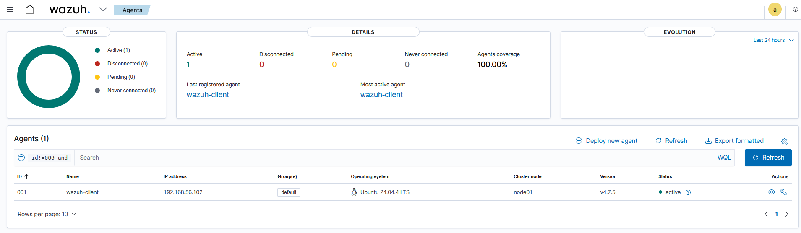
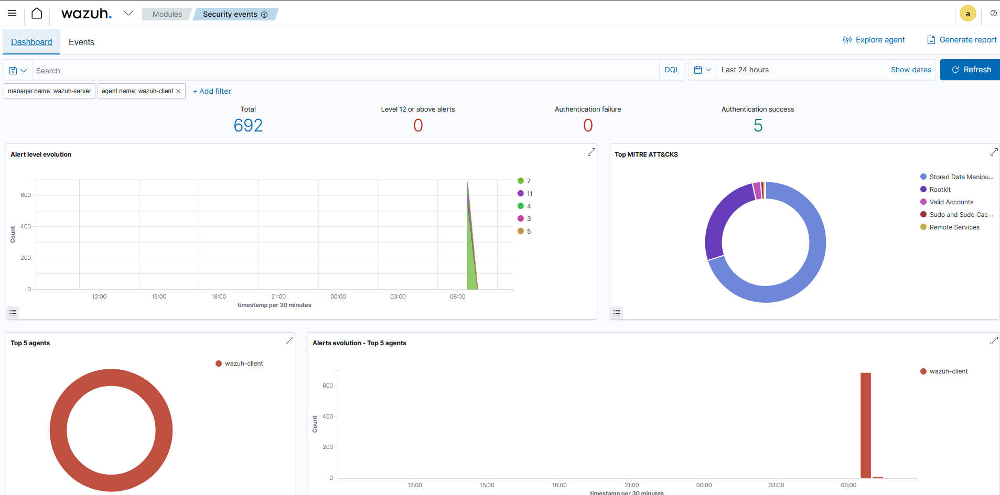
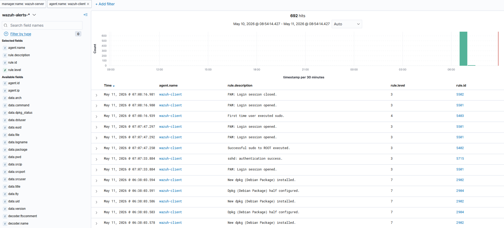
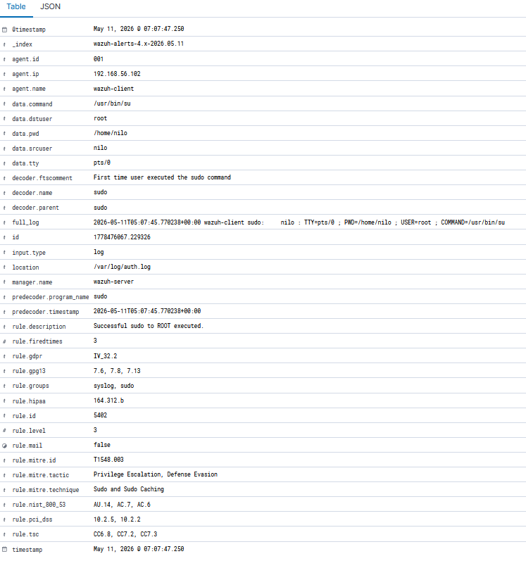

# Wazuh SIEM Lab

## Projektbeschreibung

Dieses Projekt dokumentiert den Aufbau eines einfachen **SIEM-Labs mit Wazuh**.

Die Umgebung besteht aus einem **Wazuh Server** und einem angebundenen **Wazuh Agent/Client**. Ziel war es, sicherheitsrelevante Ereignisse eines Linux-Clients zentral zu erfassen, an den Wazuh Server zu senden und im Wazuh Dashboard auszuwerten.

---

## Ziel des Projekts

Mit diesem Lab werden folgende Punkte praktisch gezeigt:

- Aufbau eines kleinen SIEM-Labs
- Einrichtung eines Wazuh Servers
- Anbindung eines Wazuh Agents
- Zentrale Sammlung von Security Events
- Analyse von SSH-, PAM-, sudo- und Paketinstallations-Events
- Darstellung der Events im Wazuh Dashboard
- Einordnung einzelner Events über Regel-ID, Regel-Level und MITRE ATT&CK

---

## Lab-Architektur

Die Umgebung wurde lokal mit **VirtualBox** aufgebaut.

```text
Windows Host
│
├── Wazuh Server VM
│   ├── Wazuh Manager
│   ├── Wazuh Dashboard
│   ├── Wazuh Indexer
│   └── IP: 192.168.56.101
│
└── Wazuh Client VM
    ├── Wazuh Agent
    └── IP: 192.168.56.102
```

Der Wazuh Agent auf dem Client sammelt sicherheitsrelevante Logs und sendet diese an den Wazuh Server. Die Events werden dort verarbeitet und im Dashboard sichtbar gemacht.

---

## Verwendete Systeme

| Komponente | System |
|---|---|
| Virtualisierung | VirtualBox |
| Server | Ubuntu Server |
| Client | Ubuntu 24.04.4 LTS |
| SIEM-Lösung | Wazuh |
| Wazuh-Version | 4.7.5 |
| Netzwerk | Host-only Netzwerk |
| Server-IP | 192.168.56.101 |
| Client-IP | 192.168.56.102 |

---

## Wazuh Server

Auf dem Wazuh Server laufen die zentralen Komponenten:

- Wazuh Manager
- Wazuh Dashboard
- Wazuh Indexer
- Wazuh API

Das Wazuh Dashboard ist über den Browser erreichbar:

```text
https://192.168.56.101
```

---

## Wazuh Agent

Der Wazuh Agent wurde auf dem Client installiert und erfolgreich mit dem Server verbunden.

| Feld | Wert |
|---|---|
| Agent-ID | 001 |
| Agent-Name | wazuh-client |
| IP-Adresse | 192.168.56.102 |
| Betriebssystem | Ubuntu 24.04.4 LTS |
| Status | active |
| Wazuh-Version | 4.7.5 |



---

## Security Events im Dashboard

Nach der erfolgreichen Verbindung des Agents wurden Security Events im Wazuh Dashboard sichtbar.

Im Dashboard wurde nach dem Agent `wazuh-client` gefiltert. Dadurch lassen sich die Events des Clients gezielt auswerten.

Erkannte Event-Arten:

- PAM Login Session opened
- PAM Login Session closed
- SSH Authentication success
- Successful sudo to ROOT executed
- First time user executed sudo
- New Debian Package installed
- dpkg package half configured



---

## Event-Liste des Clients

Die Event-Liste zeigt konkrete Security Events des Clients `wazuh-client`.

Sichtbare Felder:

- Zeitpunkt
- Agent-Name
- Rule Description
- Rule Level
- Rule ID



---

## Detailanalyse eines Security Events

In der Detailansicht wurde ein sudo-bezogenes Event des Agents `wazuh-client` geöffnet.

Wazuh erkannte eine privilegierte Aktion Richtung `root` und klassifizierte sie als:

```text
Successful sudo to ROOT executed.
```

Wichtige Felder des Events:

| Feld | Wert |
|---|---|
| Agent | wazuh-client |
| Agent-IP | 192.168.56.102 |
| Logquelle | /var/log/auth.log |
| Regel-ID | 5402 |
| Regel-Level | 3 |
| MITRE-Taktik | Privilege Escalation, Defense Evasion |
| MITRE-Technik | Sudo and Sudo Caching |



---

## Ergebnis

Das Wazuh-Lab wurde erfolgreich eingerichtet.

Erreichte Punkte:

- Wazuh Server läuft
- Wazuh Dashboard ist erreichbar
- Wazuh API funktioniert
- Wazuh Agent ist verbunden
- Client sendet Events an den Server
- Security Events werden im Dashboard angezeigt
- Einzelne Events können technisch analysiert werden
- MITRE ATT&CK-Zuordnung ist sichtbar

---

## Gelernte Inhalte

Durch dieses Projekt wurden folgende Grundlagen praktisch geübt:

- SIEM-Grundlagen
- Logsammlung und Logauswertung
- Agent-basierte Überwachung
- Linux-Authentifizierungslogs
- SSH- und sudo-Events
- Wazuh Dashboard Bedienung
- Security Monitoring
- Erste SOC-nahe Analyse von Security Events

---

## Skills demonstrated

- SIEM setup and basic configuration
- Linux log analysis
- Wazuh agent management
- Security event investigation
- MITRE ATT&CK mapping
- Basic SOC analyst workflow
- Documentation of a security lab

---

## Hinweis

Dieses Projekt ist ein lokales Lern- und Dokumentationsprojekt. Es wurde in einer isolierten VirtualBox-Lab-Umgebung umgesetzt.

Es enthält keine produktiven Zugangsdaten, keine echten Unternehmensdaten und keine sensiblen Informationen.